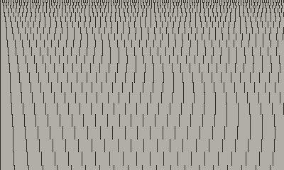
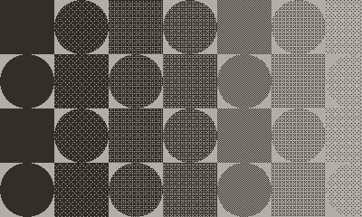
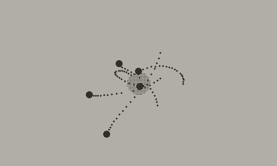
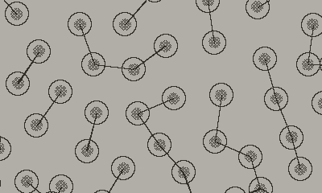
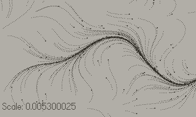
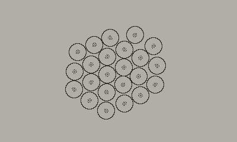

# Note.

This is older code from when Lua was still new to me, you'd be better off looking at the Coracle package in the Calx game repo for a more up-to-date and better written version of this project. This repo will be updated with updated examples and code once Calx has shipped.

# Coracle for Playdate

A port of [Coracle](https://orllewin.github.io/coracle/) to [Lua](https://www.lua.org/) to run on the [Playdate](https://play.date/).

## Usage

Clone and open in [Nova](https://nova.app/), change the drawing import in `main.lua` to switch drawings.

## Drawings

These are ported from the [Kotlin Coracle framework](https://orllewin.github.io/coracle/drawings/).

| | |
| ------------- | ------------- |
| [Hello, Coracle](https://github.com/orllewin/coracle_playdate/blob/main/Source/drawings/HelloDrawing.lua) | [Shapes](https://github.com/orllewin/coracle_playdate/blob/main/Source/drawings/ShapesDrawing.lua) |
|  |  |
| [Gravity](https://github.com/orllewin/coracle_playdate/blob/main/Source/drawings/GravityDrawing.lua) | [Avoid Closest](https://github.com/orllewin/coracle_playdate/blob/main/Source/drawings/AvoidClosestDrawing.lua)  |
|  |  |
| [Perlin Flow Field](https://github.com/orllewin/coracle_playdate/blob/main/Source/drawings/PerlinFlowFieldDrawing.lua) | [Self Organising](https://github.com/orllewin/coracle_playdate/blob/main/Source/drawings/SelfOrganisingDrawing.lua) |
|  |  |

## Example
```lua
--[[
  A port of Coracle Gravity: https://orllewin.github.io/coracle/drawings/vector/gravity/
]]
import 'Vector'
import 'SECL.lua'

local maxSpeed = 2.2
local bodyCount = 5

local blackhole = Vector:create(width/2, height/2)
local blackholeSize = 35
local blackholeMass = 0.4
local bodies = {}

function setup()
  for i = 1 , bodyCount do
    local boid = class:new()
    boid.location = Vector:create(math.random(width), math.random(height))
    boid.velocity = Vector:create(0, 0)
    table.insert(bodies, boid)
  end
end

function draw()
  background()
  
  fill(0.25)
  circle(blackhole.x, blackhole.y, blackholeSize)
  
  fill(1.0)
  
  for i = 1, bodyCount do
    circle(bodies[i].location.x, bodies[i].location.y, 5)
  end
  
  update()
end

function update()
  for i = 1, bodyCount do
    
    local body = bodies[i]
    
    local blackholeDirection = vectorMinus(blackhole, body.location)
    blackholeDirection:normalise()
    blackholeDirection:times(blackholeMass)
    
    body.velocity:plus(blackholeDirection)
    body.location:plus(body.velocity)
    
    for ii = 1, bodyCount do
      if (i ~= ii) then
        local other = bodies[ii]
        
        bodyDirection = vectorMinus(body.location, other.location)
        bodyDirection:normalise()
        bodyDirection:times(0.03)
        body.velocity:plus(bodyDirection)
        body.velocity:limit(3.0)
        body.location:plus(body.velocity)

      end
    end
  end
  
  if(crankUp())then
    blackholeSize = blackholeSize + 0.5
    blackholeMass = blackholeMass + 0.005
  end
  
  if(crankDown())then
    blackholeSize = blackholeSize - 0.5
    blackholeMass = blackholeMass - 0.005
  end
end
```

## Links
* [Playdate SDK Reference](https://sdk.play.date/1.11.1/Inside%20Playdate.html) 
* [Simple Lua Classes](http://lua-users.org/wiki/SimpleLuaClasses) 
* [SECL](https://github.com/bartbes/love-misc-libs/tree/master/SECL)
* [Batteries](https://github.com/1bardesign/batteries)

## License

[zlib](license.txt)
